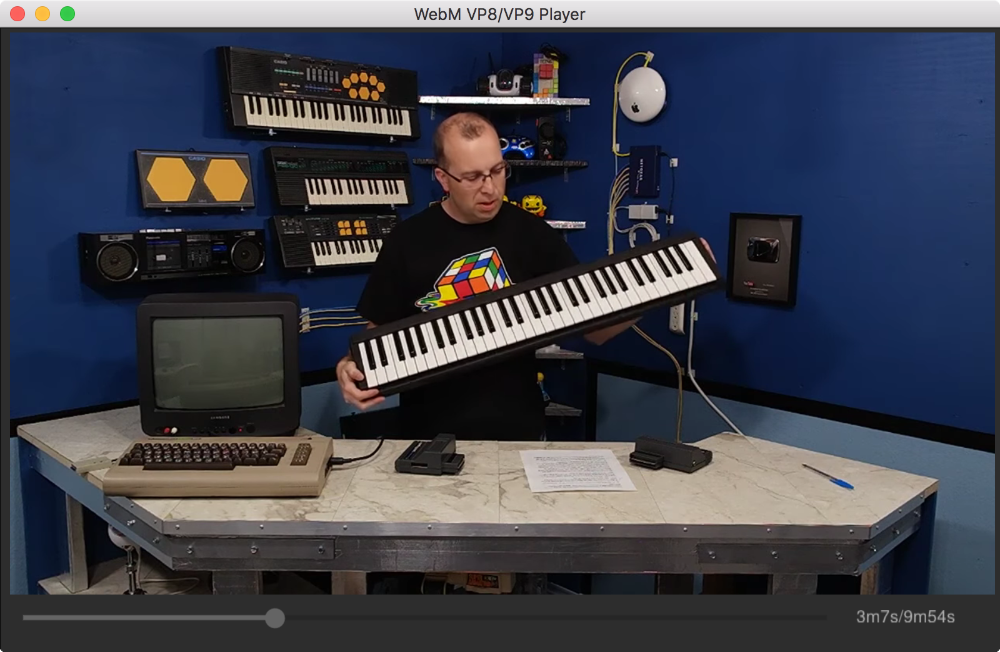

libvpx-go [](https://godoc.org/github.com/xlab/libvpx-go/vpx)
=========

Package `vpx` provides Go bindings for [libvpx-1.8.0](http://www.webmproject.org/code/), the WebM Project VPx codec implementation.
All the binding code has automatically been generated with rules defined in [vpx.yml](/vpx.yml).

### Usage

```bash
$ brew install libvpx # >= 1.8
$ brew install pkg-config
# (or use your package manager)

$ go get github.com/xlab/libvpx-go/vpx
```

### Demo application

There is a simple WebM player with support of VP8/VP9 video and Vorbis/Opus audio implemnted, see [cmd/webm-player](cmd/webm-player). To get videos to play you can use [youtube-dl](https://github.com/rg3/youtube-dl) tool that is very convenient. It supports all the formats that are in WebM container, the player would automatically find video andaudio streams in a single file or in both (only video + only audio), see usage examples below.

#### Install deps (demo app)

See also GLFW for Windows installation guide at [github.com/golang-ui/nuklear](https://github.com/golang-ui/nuklear#installation-of-nk).

```bash
$ brew install libvpx # >= 1.8
$ brew install libogg libvorbis opus portaudio
# (or use your package manager)

$ go get github.com/xlab/libvpx-go/cmd/webm-player

$ webm-player -h
A simple WebM player with support of VP8/VP9 video and Vorbis/Opus audio. Version: v1.0rc1

Usage: webm-player <file1.webm> [file2.webm]
```

For Linux (e.g. Debian Sid):

```
$ apt-get install libvpx-dev libogg-dev libvorbis-dev libopus-dev portaudio19-dev
$ go get github.com/xlab/libvpx-go/cmd/webm-player
```

#### Software used

There is a list of libraries used to build this app:

* [go-gl/glfw](http://github.com/go-gl/glfw) — Go bindings for multi-platform library for OpenGL, OpenGL ES and Vulkan development, used here to init the GL context, window and handle the input events;
* [golang-ui/nuklear](https://github.com/golang-ui/nuklear) — Go bindings for [nuklear.h](https://github.com/vurtun/nuklear) — a small ANSI C GUI library, used here to build the GUI layout, display the video frame as image, handle events sent by GLFW;
* [ebml-go/ebml](https://github.com/ebml-go/ebml) — a pure Go implementation of an [EBML](http://matroska-org.github.io/libebml/specs.html) decoder (by Jorge Acereda Macia);
* [ebml-go/webm](https://github.com/ebml-go/webm) — a pure Go implementation of a parser, reader and seeker for [WebM container](http://www.webmproject.org/docs/container/), uses EBML to decode the WebM metadata (by Jorge Acereda Macia);
* [libvpx](https://github.com/xlab/libvpx-go) — Go bindings for libvpx-1.8.0, the WebM Project VP8/VP9 codec implementation;
* [vorbis](https://github.com/xlab/vorbis-go) — Go bindings for OggVorbis implementation by the Xiph.Org Foundation;
* [opus](https://github.com/xlab/opus-go) — Go bindings for Opus implementation by the Xiph.Org Foundation;
* [portaudio](https://github.com/xlab/portaudio-go) — Go bindings for PortAudio, a free, cross-platform, open-source, audio I/O library.

#### Usage

Please keep in mind that this actually is a **VP8/VP9 decoding demo**, yet though it does audio decoding well too. Video frames are converted to RGBA using a software decoder (a function), moving that to GPU would give it a boost for 720p+ resolutions, but this is left as an excercise for you, pull requests are welcome. Also audio synchronisation is poor, I invested a couple of hours but I'm lazy to get it done right. Also no pause button, sorry.

```bash
$ youtube-dl -F w2DpLW374Sg # list all formats
$ youtube-dl -f 247 w2DpLW374Sg # webm 1280x720 vp9, 30fps, video only, 71.90MiB
$ youtube-dl -f 251 w2DpLW374Sg # webm audio only, opus @160k (48000Hz), 8.92MiB

$ webm-player ~/Downloads/w2DpLW374Sg.webm ~/Downloads/w2DpLW374Sg_opus.webm
2016/09/27 21:43:38 glfw: created window 800x500
2016/09/27 21:43:38 webm: found video track: 1280x720 dur: 9m54s V_VP9
2016/09/27 21:43:38 webm: found audio track: ch: 2 48000.0Hz, dur: 9m54s, codec: A_OPUS
2016/09/27 21:43:38 [INFO] took Video from the first stream, Audio from the second
```

<a href="https://www.youtube.com/watch?v=dQw4w9WgXcQ"></a>


```bash
$ youtube-dl -f 43 5kj5ApnhPAE # webm  640x360   medium , vp8.0,  vorbis@128k

$ webm-player ~/Downloads/5kj5ApnhPAE.webm
2016/09/27 21:40:43 glfw: created window 800x500
2016/09/27 21:40:43 webm: found video track: 640x360 dur: 12m30s V_VP8
2016/09/27 21:40:43 webm: found audio track: ch: 1 44100.0Hz, dur: 12m30s, codec: A_VORBIS
```

<a href="https://www.youtube.com/watch?v=dQw4w9WgXcQ"></a>

#### FAQ

> Does it support rick roll?

Yes, it does.

### Rebuilding the package

You will need to get the [c-for-go](https://git.io/c-for-go) tool installed first.

```
$ git clone https://github.com/xlab/libvpx-go && cd libvpx-go
$ make clean
$ make
```

## License

All the code except when stated otherwise is licensed under the MIT license.
